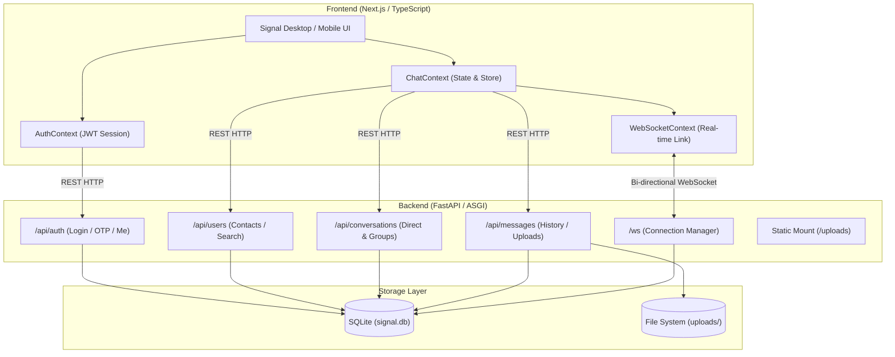

# Signal Messenger Clone — Fullstack Platform

A production-grade, secure messaging platform modeled after the official Signal Messenger app. Built with **Next.js (TypeScript)** on the frontend and **Python (FastAPI)** on the backend, featuring real-time WebSockets, SQLite database persistence, and Signal's design aesthetics.

## 🚀 Live Demo

Try the deployed application here:

**[https://the-signal-clone.vercel.app/](https://the-signal-clone.vercel.app/)**

For quick evaluation, use one of the pre-seeded demo users with the fixed mock OTP `123456`:

- `sarah_c`
- `alex_r`
- `david_k`
- `maria_s`
- `elena_r`

---

## 📸 Overview & Features

### Core Messaging & Workflows
- **Authentication & Onboarding**:
  - Register with a phone number or username.
  - Mocked phone verification with fixed OTP (`123456`).
  - Set display name, bio, and custom profile avatar.
  - JWT session persistence in `localStorage`.
  - **Quick Demo User Switcher**: One-click login / account switching between 5 pre-seeded personas (*Sarah Connor, Alex Rivera, David Kim, Maria Santos, Elena Rostov*) for instantaneous testing and evaluation across browser windows.
- **Conversations & Contacts**:
  - Left-hand sidebar matching Signal Desktop.
  - Sorted by most recent activity with unread message badges.
  - Real-time search filter (`Ctrl+K` / `Cmd+K` keyboard shortcut).
  - Add new contacts by phone or username.
  - Online / offline status indicators and last-seen timestamps.
- **1-on-1 Direct Messaging**:
  - Sub-millisecond direct message delivery via WebSockets.
  - Message status progression: **Sending (Clock)** ➔ **Sent (Single check)** ➔ **Delivered (Double gray check)** ➔ **Read (Double blue check)**.
  - Real-time typing indicators (*"Alex is typing..."*).
  - Persistent SQLite storage.
- **Group Messaging**:
  - Create groups with name, description, avatar, and multi-select members.
  - View member list, promote/demote admins.
  - Add or remove members with admin access control.
  - System messages tracking group lifecycle.
- **Signal Experience & Aesthetics**:
  - Pixel-perfect recreation of Signal's dark palette (`#121212`, `#1e1e1e`, `#282828`) and Signal Ultramarine Blue accents (`#2c6bed`).
  - Both **Signal Dark** and **Signal Light** modes supported.
  - End-to-end encryption banners and simulated cryptographic badge indicators.
  - Responsive layout for desktop split-pane and mobile drawer navigation.

### Bonus Features Implemented
- **Attachments (Media & Documents)**: Upload and preview images, file cards with download links and size formatting. Full-screen zoom modal for images.
- **Message Reactions**: Hover action bar with emoji reactions (❤️, 👍, 😂, 😮, 😢, 🔥) and interactive reaction counter pills.
- **Reply-to / Quoted Messages**: Quote previous messages with a contextual preview banner above composer and in message bubbles.
- **Disappearing Messages (Functional)**: Configurable room timers (*Off, 30s, 5m, 1h, 1d, 1w*). Messages expire and are automatically purged from the conversation view and database upon expiration.
- **Mocked Cryptographic Safety Numbers**: View and verify 60-digit safety number fingerprint blocks and simulated QR code.
- **Simulated Voice & Video Calls**: Interactive call modal with connection simulation, audio waveform state, camera toggle, and timer.

---

## 🛠️ Technology Stack

| Component | Technology | Rationale |
| :--- | :--- | :--- |
| **Frontend** | Next.js 16 (App Router), TypeScript, React 19 | High-performance, modular component architecture, SSR & client state management. |
| **Styling** | Vanilla CSS (CSS Variables & Design System) | Clean, flexible Signal design tokens without bulky CSS framework overhead. |
| **Icons** | Lucide React | Lightweight, pixel-perfect SVG iconography matching Signal. |
| **Backend** | Python 3.11+, FastAPI, Uvicorn | High-throughput asynchronous ASGI framework with native WebSocket support. |
| **Database** | SQLite, SQLAlchemy 2.0 ORM | Self-contained, portable relational schema with foreign key constraints. |
| **Real-time** | WebSockets (`/ws`) | Bidirectional full-duplex communication for messaging, typing, and read receipts. |
| **Auth** | PyJWT, SHA-256 HMAC | Stateless token-based authentication with mock OTP validation. |

---

## 🏛️ Architecture Overview



---

## 🗄️ Database Schema

The database is built on relational SQLite using SQLAlchemy with cascading foreign keys:

### 1. `users`
| Column | Type | Description |
| :--- | :--- | :--- |
| `id` | String(36) PK | UUID v4 identifier |
| `username` | String(50) UNIQUE | Unique handle (index) |
| `phone` | String(25) UNIQUE | Phone number (index) |
| `display_name` | String(100) | User's full display name |
| `avatar_url` | Text | Profile picture URL |
| `about` | String(255) | Status message / bio |
| `password_hash` | String(255) | Password hash |
| `is_online` | Boolean | Real-time presence flag |
| `last_seen` | DateTime (UTC) | Last activity timestamp |
| `created_at` | DateTime (UTC) | Creation timestamp |

### 2. `contacts`
| Column | Type | Description |
| :--- | :--- | :--- |
| `id` | String(36) PK | UUID v4 |
| `user_id` | String(36) FK | Owner `users.id` (CASCADE) |
| `contact_user_id`| String(36) FK | Target `users.id` (CASCADE) |
| `nickname` | String(100) | Optional user alias |
| `created_at` | DateTime (UTC) | Contact creation date |

### 3. `conversations`
| Column | Type | Description |
| :--- | :--- | :--- |
| `id` | String(36) PK | UUID v4 |
| `is_group` | Boolean | Flag distinguishing 1-on-1 vs Group |
| `name` | String(100) | Group title (or null for direct chats) |
| `avatar_url` | Text | Group avatar |
| `description` | String(255) | Group description |
| `created_by_id` | String(36) FK | Creator `users.id` |
| `disappearing_timer` | Integer | Timer in seconds (0 = disabled) |
| `updated_at` | DateTime (UTC) | Last activity (index / ordering) |
| `created_at` | DateTime (UTC) | Creation date |

### 4. `conversation_participants`
| Column | Type | Description |
| :--- | :--- | :--- |
| `id` | String(36) PK | UUID v4 |
| `conversation_id`| String(36) FK | `conversations.id` (CASCADE) |
| `user_id` | String(36) FK | `users.id` (CASCADE) |
| `role` | String(20) | Member role (`admin`, `member`) |
| `last_read_message_id` | String(36) | Pointer for unread counting |
| `joined_at` | DateTime (UTC) | Join date |

### 5. `messages`
| Column | Type | Description |
| :--- | :--- | :--- |
| `id` | String(36) PK | UUID v4 |
| `conversation_id`| String(36) FK | `conversations.id` (CASCADE) |
| `sender_id` | String(36) FK | `users.id` (CASCADE) |
| `content` | Text | Message body or system message |
| `message_type` | String(20) | `text`, `image`, `file`, `system` |
| `file_url` | Text | Uploaded file path |
| `file_name` | String(255) | Original uploaded file name |
| `file_size` | Integer | File size in bytes |
| `reply_to_id` | String(36) FK | Quoted message `messages.id` |
| `status` | String(20) | `sending`, `sent`, `delivered`, `read` |
| `expires_at` | DateTime (UTC) | Disappearing message expiration |
| `is_deleted` | Boolean | Soft-deletion flag |
| `created_at` | DateTime (UTC) | Sent timestamp |

### 6. `message_reactions`
| Column | Type | Description |
| :--- | :--- | :--- |
| `id` | String(36) PK | UUID v4 |
| `message_id` | String(36) FK | `messages.id` (CASCADE) |
| `user_id` | String(36) FK | Reactor `users.id` (CASCADE) |
| `emoji` | String(16) | Emoji reaction character |
| `created_at` | DateTime (UTC) | Reaction timestamp |

---

## 📡 API Overview

### Authentication (`/api/auth`)
- `POST /api/auth/register` — Register a new account.
- `POST /api/auth/login` — Sign in via username/phone with mock OTP (`123456`).
- `GET /api/auth/me` — Retrieve authenticated user profile.
- `GET /api/auth/demo-users` — Retrieve demo users for one-click switching.

### Users & Contacts (`/api/users`)
- `GET /api/users/search?q={query}` — Search users by display name, username, or phone.
- `PUT /api/users/profile` — Update display name, about status, or avatar.
- `POST /api/users/avatar` — Upload profile avatar image.
- `GET /api/users/contacts` — Fetch contact list.
- `POST /api/users/contacts` — Add user to contacts.

### Conversations (`/api/conversations`)
- `GET /api/conversations` — Fetch all user conversations with last message and unread count.
- `POST /api/conversations/direct` — Start or retrieve a 1-on-1 direct conversation.
- `POST /api/conversations/group` — Create a new group chat.
- `GET /api/conversations/{id}` — Fetch conversation details and participants.
- `PUT /api/conversations/{id}` — Update conversation settings (name, disappearing messages timer).
- `POST /api/conversations/{id}/members` — Add member to group (admin only).
- `DELETE /api/conversations/{id}/members/{user_id}` — Remove member or leave group.
- `POST /api/conversations/{id}/read` — Mark conversation messages as read.

### Messages (`/api/messages`)
- `GET /api/messages/{conversation_id}` — Get message history with reply snippets and reactions.
- `POST /api/messages` — Send a message (text or attachment with optional reply-to).
- `POST /api/messages/{message_id}/reactions` — Toggle emoji reaction on message.
- `DELETE /api/messages/{message_id}` — Soft delete a message.
- `POST /api/messages/upload` — Upload an attachment (image or document).

### WebSockets (`/ws?token={jwt}`)
Real-time full duplex communication channel:
- Client `typing` event ➔ Server broadcasts typing indicator to room participants.
- Client `mark_read` event ➔ Server updates statuses and broadcasts `messages_read` with blue double-check receipts.
- Server `new_message` ➔ Broadcasts live message to recipients.
- Server `user_status` ➔ Broadcasts online / offline presence changes.

---

## 🚀 Setup & Installation Instructions

### Prerequisites
- **Python**: 3.10+ installed
- **Node.js**: v18+ or v20+ with `npm`

### 1. Backend Setup
```bash
# Navigate to the backend directory
cd backend

# Create and activate a virtual environment (optional but recommended)
python -m venv venv
# On Windows:
venv\Scripts\activate
# On macOS/Linux:
source venv/bin/activate

# Install dependencies
pip install -r requirements.txt

# Start the FastAPI server (auto-seeds database on first run)
python run.py
```
The backend API is now running at `http://localhost:8000`. Interactive OpenAPI documentation is available at `http://localhost:8000/docs`.

### 2. Frontend Setup
```bash
# In a new terminal, navigate to the frontend directory
cd frontend

# Install dependencies
npm install

# Start the development server
npm run dev
```
The application is now live at `http://localhost:3000`.

### 3. Testing the Application
1. Open `http://localhost:3000` in your browser.
2. Click on **Sarah Connor** (or enter identifier `sarah_c` and OTP `123456`).
3. To test real-time messaging between two users:
   - Open an Incognito / Private window or second browser.
   - Go to `http://localhost:3000` and sign in as **Alex Rivera** (`alex_r`).
   - Chat in real-time between Sarah and Alex — observe instant delivery, live typing notifications, read receipts, and reactions!

---

## 💡 Assumptions & Design Decisions
1. **Mocked Verification**: Real SMS telecom gateways and cryptographic key exchanges are mocked as permitted by the specification. Any user can authenticate with the fixed OTP `123456`.
2. **End-to-End Encryption**: End-to-end encryption protocols are visually simulated with safety number verification matrices, cryptographic banners, and secure room locks.
3. **Disappearing Messages**: Disappearing message countdowns are calculated server-side based on room settings and verified by both the client timer display and server fetch queries.
4. **Data Seeding**: The database automatically seeds realistic Signal conversations, direct chats, group rooms, contacts, and message dialogues on its first boot.

---

## 📄 License
MIT License. Built for the Scaler SDE Fullstack Assignment.
